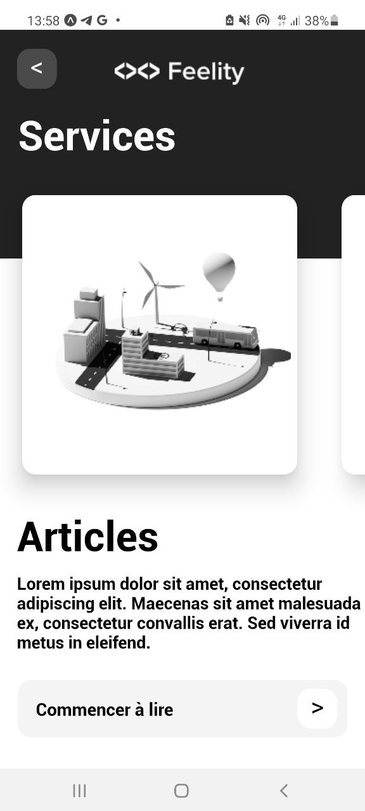

# Feelity_App

## Test Application

## Overview

FeeliTy is a mobile application designed to provide users with easy access to various services and articles. The app features a modern and clean design, making it user-friendly and visually appealing.
Features

- Service Cards: Swipe through various services provided by FeeliTy.
- Articles Section: Read engaging articles related to the services.
- Custom Navigation: Easily navigate through the app with custom header and footer buttons.

## Development

This application was developed using React Native and was tested primarily on Android devices. The following tools and libraries were used in the development process:

- Expo: For building and deploying the React Native application.
- React Navigation: For handling navigation within the app.
- Custom Components: Various custom components for buttons, cards.

## Development on Android

This application was primarily developed and tested on Android devices. For the best experience, it is recommended to use an Android device or emulator for testing and development.
